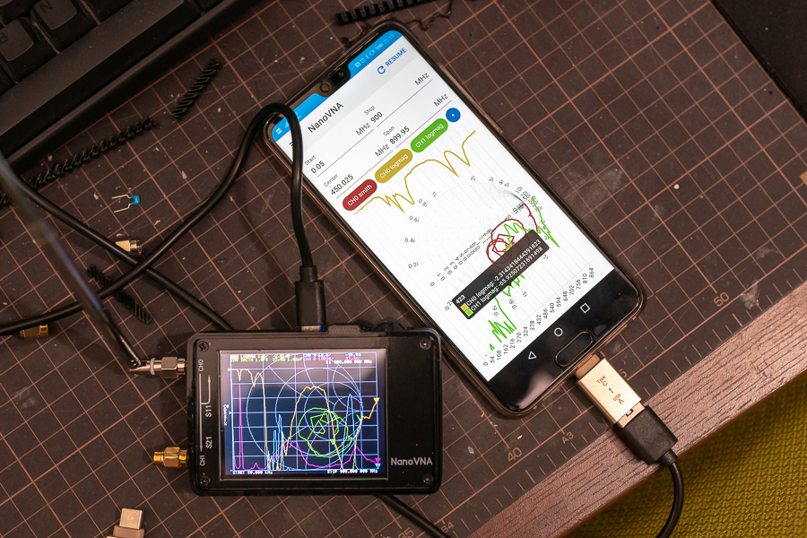
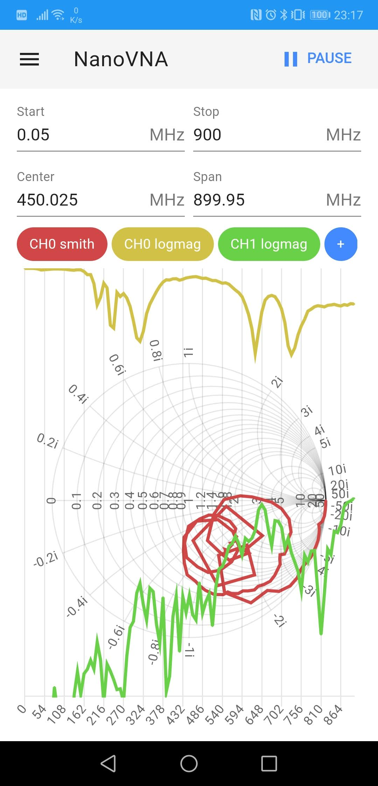
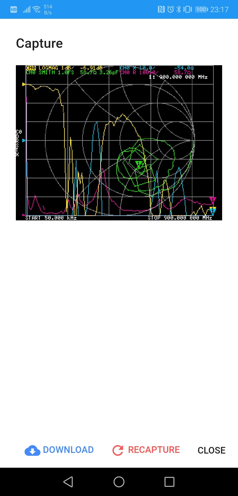
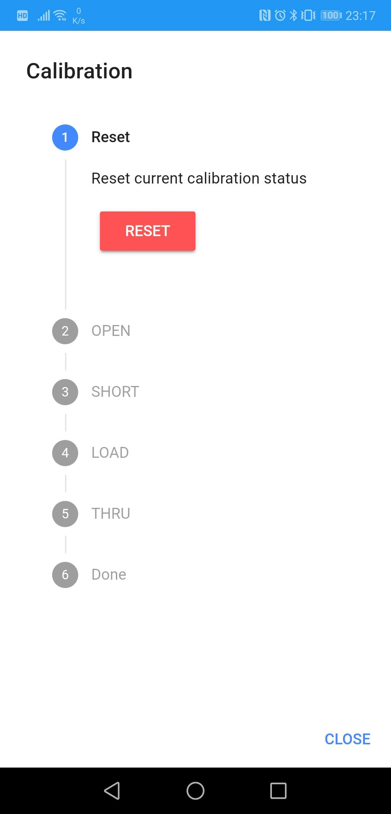

# NanoVNA-Web-Client

Very alpha version.

https://cho45.stfuawsc.com/NanoVNA/

<a href="https://github.com/ttrftech/NanoVNA">NanoVNA</a> interface implementation with WebUSB.


# Usage

# RUN with WebSerial

Chrome 78 enables WebSerial by default!

1. Access to https://cho45.stfuawsc.com/NanoVNA/ .
2. Connect your NanoVNA to USB port.
3. Click [CONNECT] and select the device.

<!--
# RUN with WebUSB

1. Access to https://cho45.stfuawsc.com/NanoVNA/ .
2. Connect your NanoVNA to USB port.
3. Click [CONNECT] and select the device.

Some OSes are additional requirements:

## Requirements

### macOS

no requirements

### Android

Connect device via USB OTG connector. (Type-C to Type-C cable may not be usable. I recommend using USB-A OTG adapter.)

### Linux (Ubuntu)

Copy <a href="./etc/99-nanovna.rules">99-nanovna.rules</a> to your /etc/udev/rules.d.

BE CAREFUL: This rule disables `cdc_acm` driver for all STM32CDC devices (vid:0x0483, pid:0x5740). So, If you want to use device as usb cdc device, you must remove this file again.

### Windows

Replace driver with <a href="https://zadig.akeo.ie/">Zadig</a>.

-->
# Screenshots



Connect via USB OTG connector.

   


# Build

This project uses Rust partially for DSP. 

## Install some tools

- <a href="https://www.rust-lang.org/tools/install">Install Rust</a>

and install build tools as following:

```
$ cargo install wasm-pack
$ cargo install --force cargo-make

```

See also <a href="https://developer.mozilla.org/en-US/docs/WebAssembly/Rust_to_wasm">Compiling from Rust to WebAssembly</a>


# Android App

# Install


Play Store: https://play.google.com/store/apps/details?id=net.lowreal.nanovnawebapp

# Install latest nightly


https://github.com/cho45/NanoVNA-Web-Client/releases/tag/latest

Download \*.apk from your android.

notes:
 * Uninstall release build before installing lastest nightly.

# Open with Android Studio

```
$ make cap
$ npx cap open android
```

## (relen)

 * Edit android/app/build.gradle and increment version
 * commit version
 * tag version
 * Build -> Generate Signed Bundle / APK
 * Android Build Bundle

