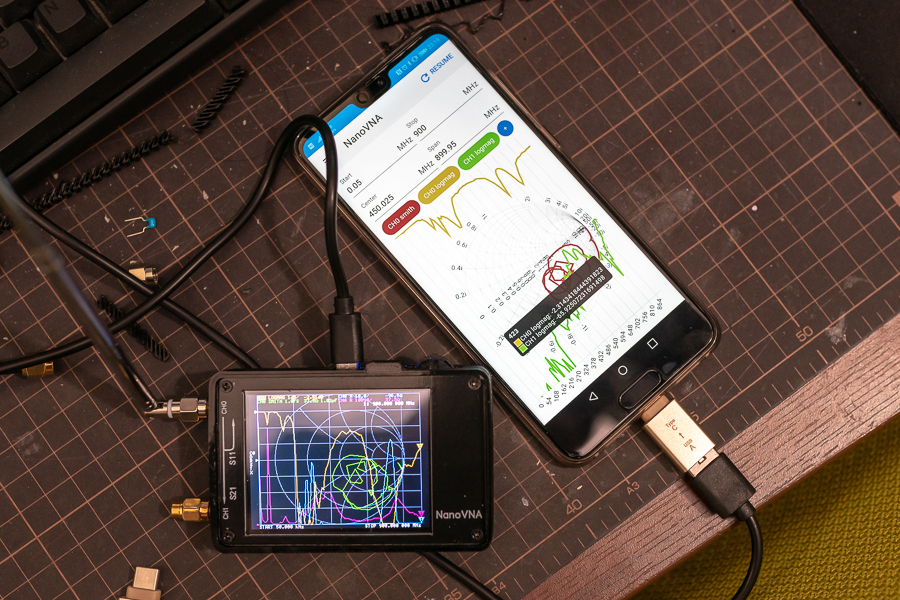
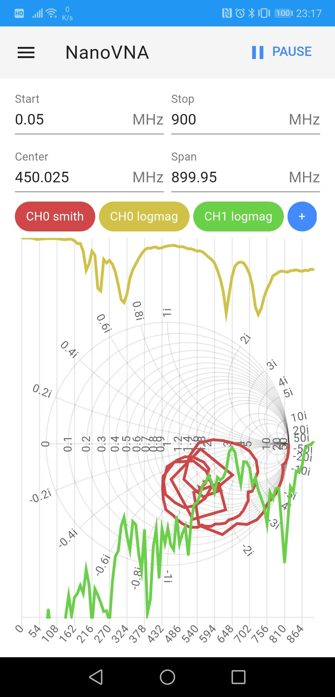
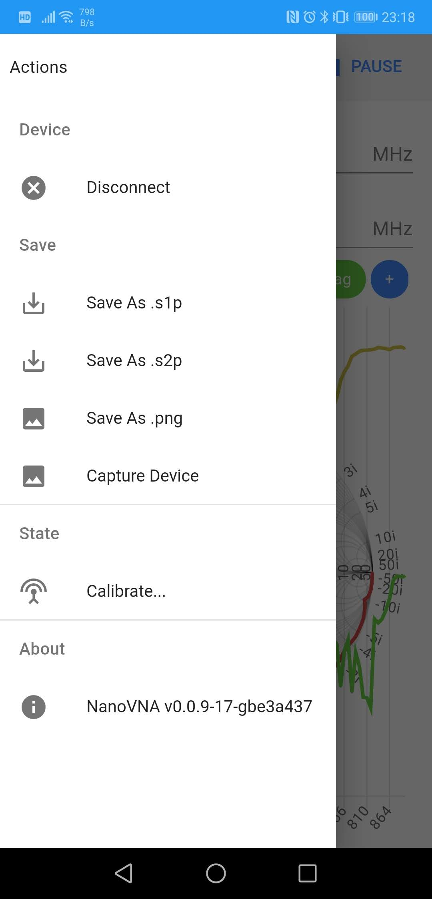
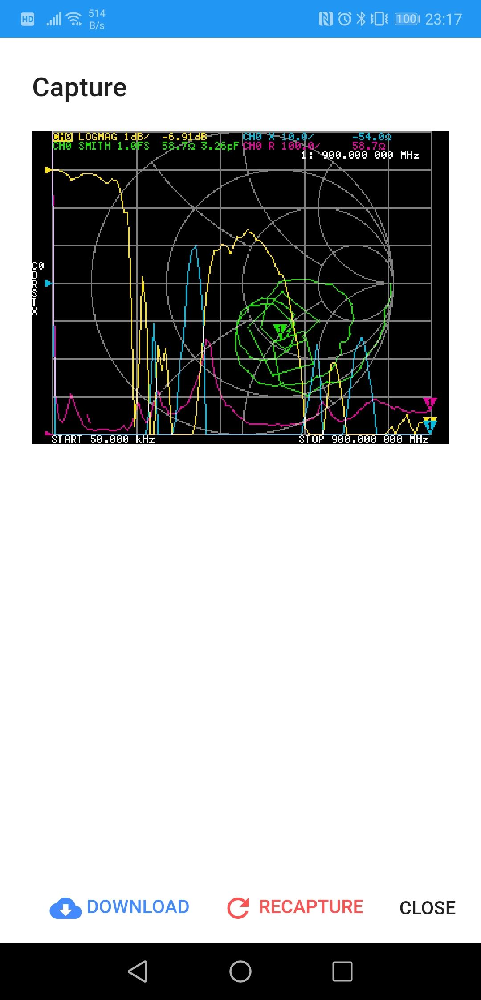
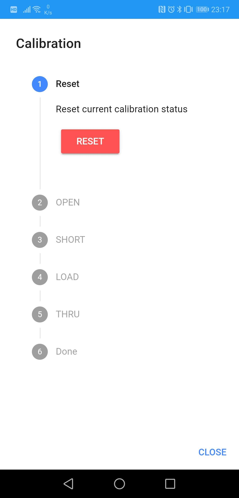

# NanoVNA-Web-Client



Very alpha version.

https://cho45.stfuawsc.com/NanoVNA/

<a href="https://github.com/ttrftech/NanoVNA">NanoVNA</a> interface implementation with WebUSB/WebSerial.

# Usage

1. Access to https://cho45.stfuawsc.com/NanoVNA/ .
2. Connect your NanoVNA to USB port.
3. Click [CONNECT] and select the device.

### Requirements

#### macOS

no requirements

#### Linux

Add your user to ensure you have permission to access serial port (e.g. `dialout` group).

```bash
sudo usermod -a -G dialout $USER
```

#### Windows

No special driver is required on Windows 10 or later. (Use standard USB Serial driver)

# Screenshots

Connect via USB OTG connector.

   


# Development & Build

This project uses **Vue 3** for the UI and **Rust** for high-performance DSP via WebAssembly.

## Prerequisites

- **Node.js**: v18+
- **Rust**: For DSP development
- **wasm-pack**: `cargo install wasm-pack`
- **cargo-make**: `cargo install cargo-make`

## Local Development

```bash
# Install dependencies
npm install

# Start Vite development server
npm run dev
```

## Building the WASM Module

If you modify the DSP logic in `dsp-wasm/src`, rebuild the module:

```bash
cd dsp-wasm
cargo make build-web
```

## Building for Production

To build the application for production deployment:

```bash
npm run build
```

The build artifacts will be generated in the `dist` directory.

## Running Tests

```bash
npm test
```

# App: Android

Android App support has been discontinued in favor of WebSerial. Please use the PWA instead.


# License

[GPLv2](COPYING)

